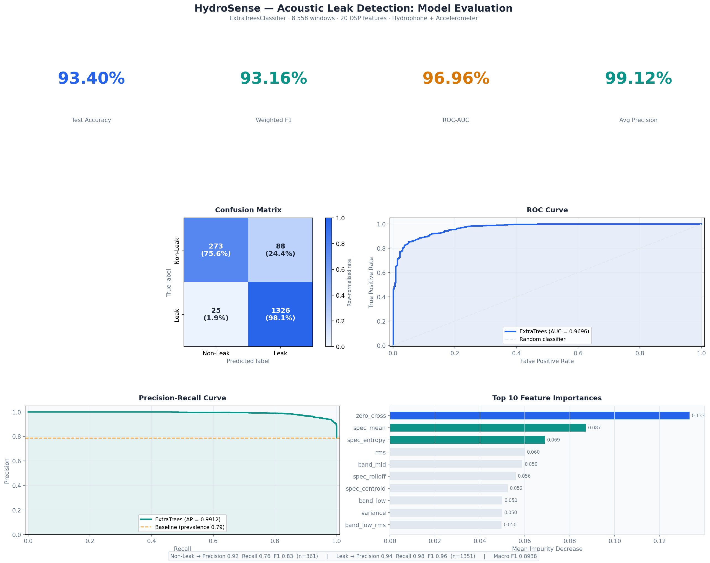

# HydroSense — Acoustic Pipe Leak Detection

An end-to-end machine learning pipeline that detects water pipe leaks from raw acoustic sensor data (hydrophone + accelerometer). Achieves **93.40% test accuracy** using an ExtraTreesClassifier trained on DSP-derived features.

---

## Results

| Metric | Value |
|---|---|
| Test Accuracy | **93.40%** |
| Weighted F1 | **93.16%** |
| ROC-AUC | **96.96%** |
| Average Precision | **99.12%** |



---

## Dataset

**Source:** [Mendeley Data — Acoustic Pipe Leak Detection](https://data.mendeley.com/datasets/tbrnp6vrnj/1)

| Sensor | Format | Sample Rate |
|---|---|---|
| Hydrophone | PCM_32 `.raw` (via SoundFile) | 8 000 Hz |
| Accelerometer | `.csv` (`Sample`, `Value` columns) | ~25 641 Hz |

**Labels** are derived from ZIP folder names:

| Folder | Label |
|---|---|
| `No-leak`, `Background Noise` | 0 — Non-Leak |
| `Circumferential Crack`, `Gasket Leak`, `Longitudinal Crack`, `Orifice Leak` | 1 — Leak |

202 raw files → **8 558 windowed rows** (1-second windows, 50% overlap) × 20 features.

---

## Pipeline

```
scripts/
├── 01_smart_sampler.py      # Extract & organize raw files from ZIPs → data/
├── 02_feature_extractor.py  # DSP + windowed feature extraction → data/features_balanced.csv
├── 03_train_model.py        # GridSearchCV (RF + ExtraTrees) + soft-vote ensemble → models/
└── 04_visualize_results.py  # Professional results dashboard → models/results_dashboard.png
```

### Step 1 — Smart Sampler
Reads both source ZIPs, maps folder names to labels, and copies the 202 raw files into `data/` with a flat naming convention.

### Step 2 — Feature Extractor
For each file:
1. Bandpass filter (Butterworth order 4)
   - Hydrophone: 20 – 3 800 Hz
   - Accelerometer: 10 – 5 000 Hz
2. Slice into 1-second windows with 50% overlap
3. Per window: detrend → Hann-windowed FFT → extract 20 features

**20 features per window:**

| Domain | Features |
|---|---|
| Time | mean, variance, rms, kurtosis, skewness, peak, crest_factor, zero_cross |
| Frequency | spec_mean, spec_var, spec_max, spec_entropy, spec_centroid, spec_rolloff |
| Band energy | band_low, band_mid, band_high, band_low_rms, band_high_rms |
| Sensor | sensor_type (0 = Hydrophone, 1 = Accelerometer) |

### Step 3 — Train Model
- `StandardScaler` → 80/20 stratified split
- `GridSearchCV` (5-fold) over `RandomForestClassifier` and `ExtraTreesClassifier`
  - `n_estimators`: 300, 600
  - `max_depth`: None, 20, 30
  - `max_features`: sqrt, 0.3
  - `min_samples_split`: 2, 5
  - `class_weight`: balanced
- Best single model (ExtraTrees, CV 92.49%) beats soft-vote ensemble on test set
- Saves `models/random_forest_model.pkl` + `models/scaler.pkl`

### Step 4 — Visualize Results
Generates a 6-panel dashboard:
- Key metric boxes (accuracy, F1, ROC-AUC, AP)
- Normalized confusion matrix
- ROC curve with AUC
- Precision-recall curve
- Top 10 feature importances

---

## Quick Start

### Requirements
- Python 3.10+
- Windows (paths use `\`; adapt separators for Linux/macOS)

### Install

```powershell
python -m venv venv
.\venv\Scripts\Activate.ps1
pip install -r requirements.txt
```

### Run the full pipeline

```powershell
# 1. Extract raw files from ZIPs
python scripts/01_smart_sampler.py

# 2. Extract DSP features
python scripts/02_feature_extractor.py

# 3. Train the model
python scripts/03_train_model.py

# 4. Generate results dashboard
python scripts/04_visualize_results.py
```

Outputs land in `data/` and `models/`.

---

## Project Structure

```
HydroSense/
├── config.py                        # Central constants (paths, DSP params, labels)
├── requirements.txt
├── data/
│   └── features_balanced.csv        # 8 558 × 21 (20 features + label)
├── models/
│   ├── random_forest_model.pkl      # Trained ExtraTreesClassifier
│   ├── scaler.pkl                   # Fitted StandardScaler
│   ├── results_dashboard.png        # Full evaluation dashboard
│   ├── confusion_matrix.png
│   └── feature_importance.png
└── scripts/
    ├── 01_smart_sampler.py
    ├── 02_feature_extractor.py
    ├── 03_train_model.py
    └── 04_visualize_results.py
```

---

## Key Configuration (`config.py`)

| Constant | Value | Description |
|---|---|---|
| `HYDROPHONE_FS` | 8 000 Hz | Hydrophone sample rate |
| `HYDROPHONE_LOW_CUT` / `HIGH_CUT` | 20 / 3 800 Hz | Bandpass range |
| `ACCELEROMETER_FS` | 25 641 Hz | Accelerometer sample rate |
| `ACCELEROMETER_LOW_CUT` / `HIGH_CUT` | 10 / 5 000 Hz | Bandpass range |
| `HYDROPHONE_WINDOW_SIZE` | 8 000 samples | 1-second window |
| `HYDROPHONE_HOP_SIZE` | 4 000 samples | 50% overlap |
| `ACCELEROMETER_WINDOW_SIZE` | 25 641 samples | 1-second window |
| `ACCELEROMETER_HOP_SIZE` | 12 820 samples | 50% overlap |

---

## Notes on Accuracy

The 93.40% is measured on a **window-level** 20% held-out split. Because windows from the same recording can appear in both train and test, true out-of-recording generalization may be slightly lower. A file-grouped split would give a more conservative estimate.
